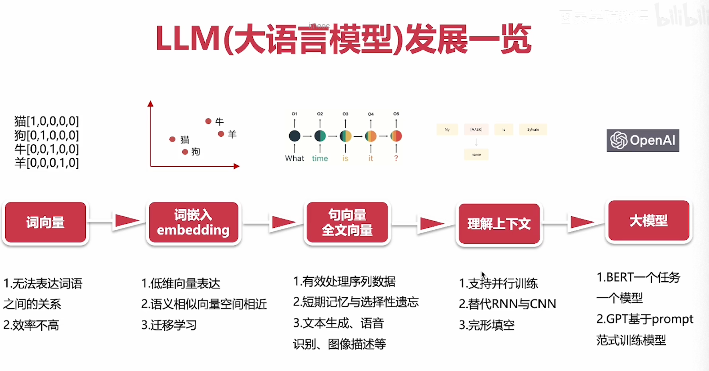
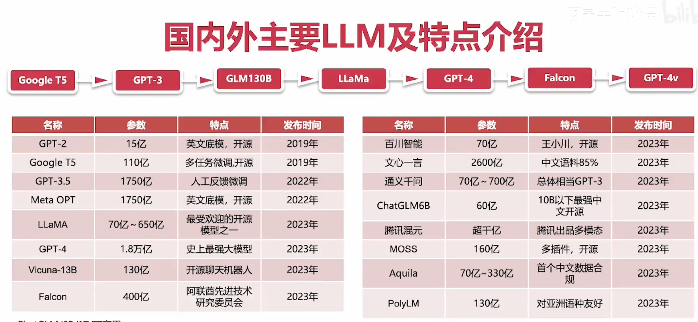
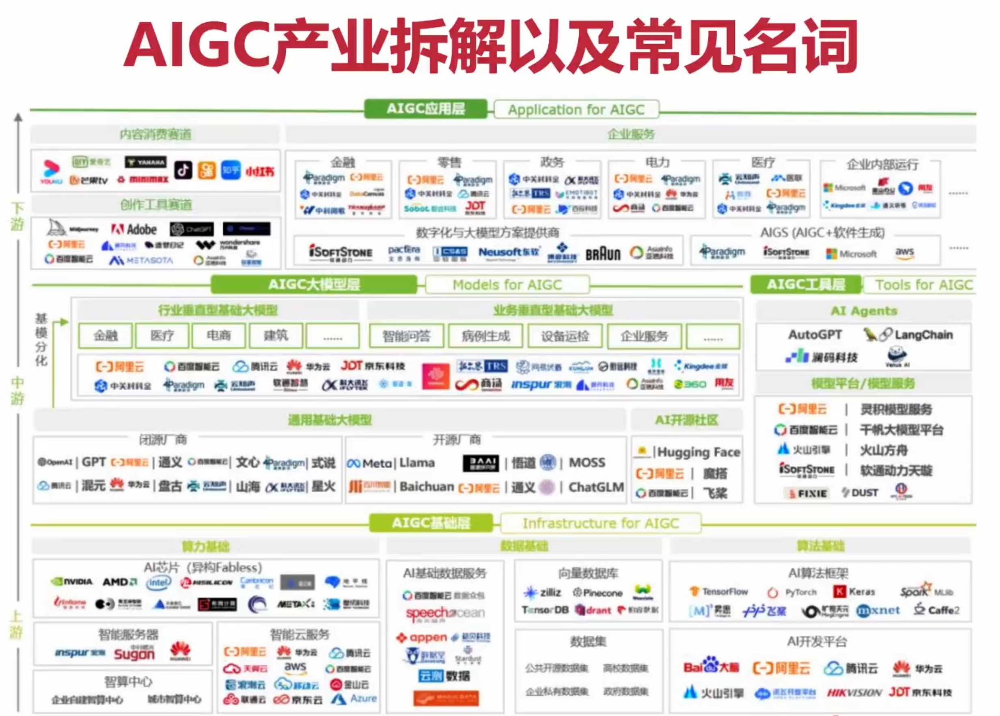
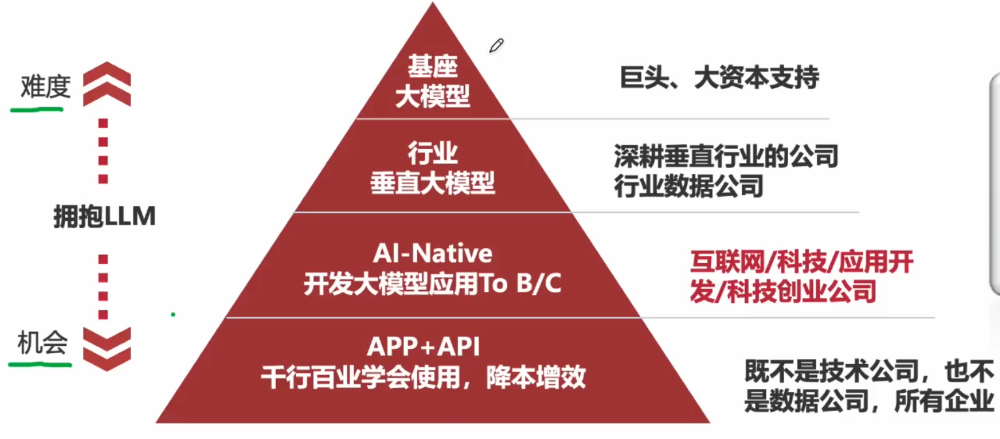
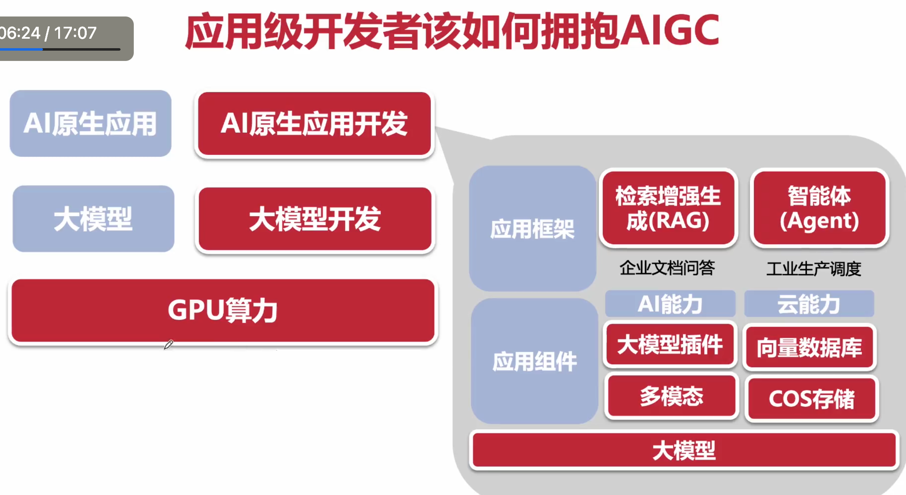
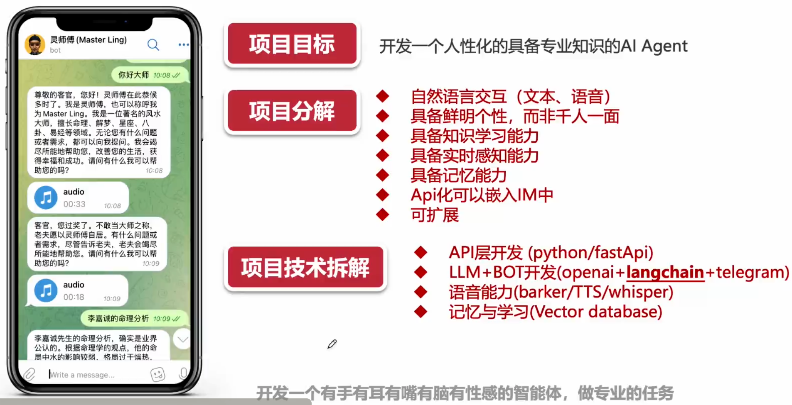

# 第一章、多模型强应用

## Agent

Agent 是下一代人机交互的方式。通过告诉 AI 你想要的东西，然后交给 Agent 完成

Agent 能做什么

1. AI 协同工作

2. 自我迭代学习

3. 软件开发

例子：客户服务、健康管理、数据可视化、私人助理等

## LLM 发展史

1. AI 1.0 特点

通用性比较差，如深蓝象棋 AI 等，只会干一件事情

2. AI 2.0

大语言模型，助力生成 AGI。整体呈由点到面的发展

- 词向量
- 词嵌入（大语言模型预训练的初始 原型）
- 句向量，全文向量
- 理解上下文（真 预训练模式）
- 大模型（从单线训练到并行，到多任务）

## 国内外 LLM 特点

https://huggingface.co/ huggingface AI 界的 github

## 大模型不足

1. 不具备记忆能力，上下文窗口限制（即 input，output）

- 例如 chatgpt 之前是 32k，目前有 128k，差不多一本书的数量

2. 实时信息更新慢，新旧知识难以区分

3. 无法灵活的操控外部系统

4. 无法为领域问题，提供专业靠谱的答案

## AIGC 产业拆解

如何拥抱 AIGC

应用级开发者拥抱 AIGC

## 虚拟项目实战

