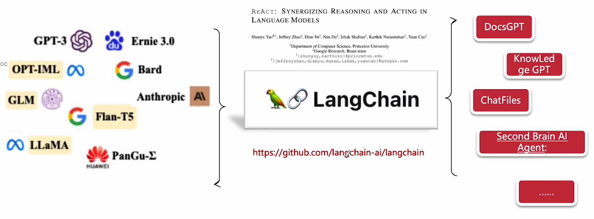
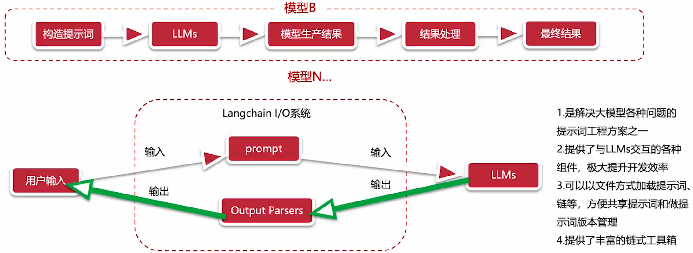

# Langchain: LLM 大模型与 AI应用的粘合剂

Langchain 作为 LLM 和 AI应用的中间层，胶水层。能够粘合模型，兼容多个 LLM 接口

## Langchain

Langchain 是个开源框架，旨在简化使用大语言模型构建端到端应用程序的过程，它也是 ReAct (reason + act) 论文的落地实现

AGI: 分析原因 + 拆分行动 + 获得信息 + 下一步动作循环

## Langchain 能力

1. LLMs & Prompt：提供了和 LLM 交互的各种组件，以统一的 api 接口输出

2. Chains：链式的工具箱

3. RAG（检索增强生成）Retrieval Augemented Generation

4. Agent

5. Memory

6. Evaluation：评估能力，对 LLM 进行评估

## 优劣势

优势

1. 具有大语言模型能力调用，支持多模态调用

2. 尽量级 SDK（python，js）

劣势

1. 学习成本比较高，文档还不完善

2. 缺乏大型工业应用实践

