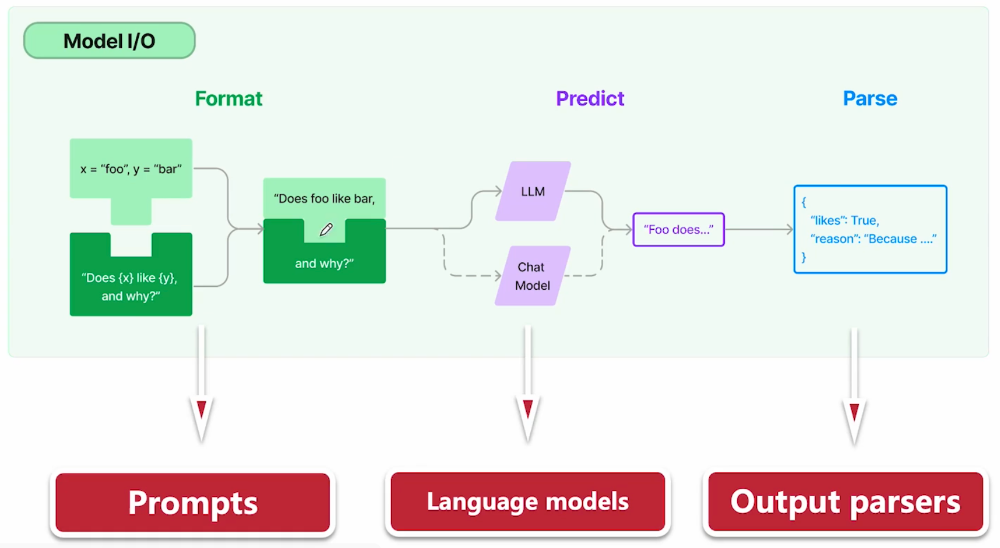
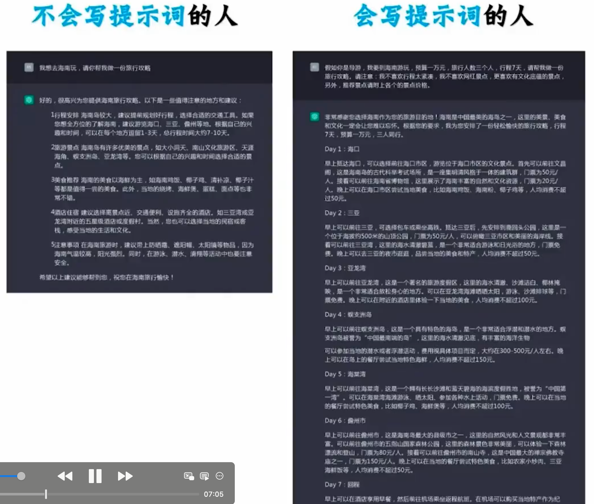
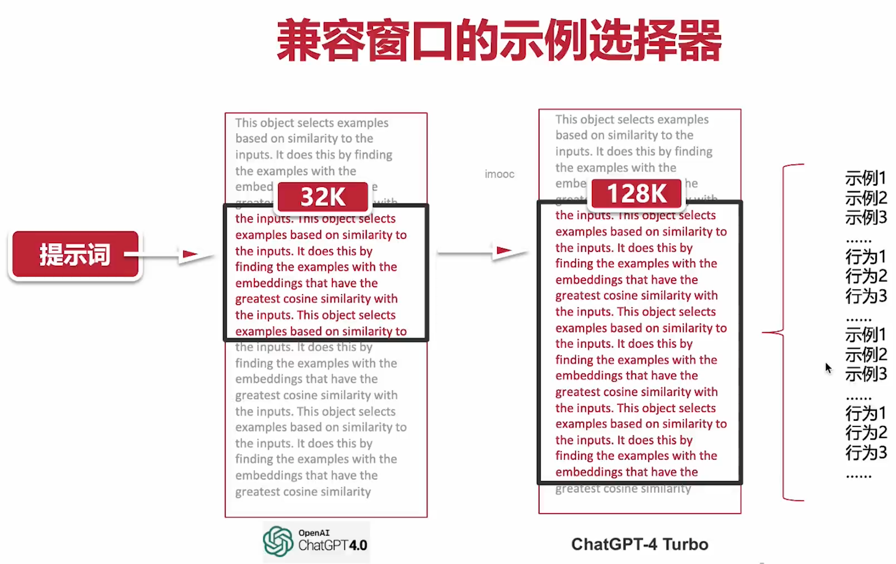
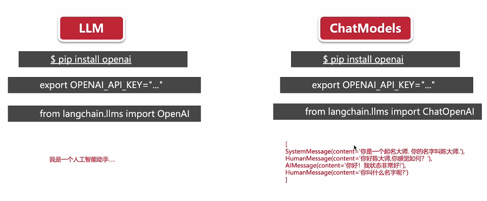
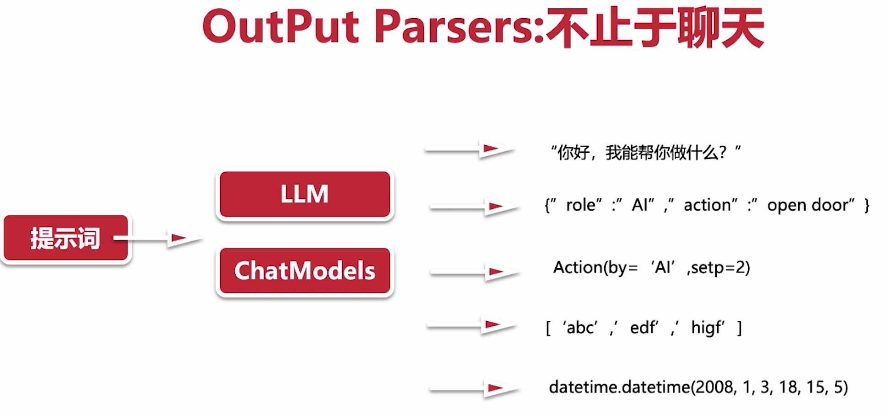

# Langchain 核心模块

## LLLM 交互接口

1. 输入

提示词模块，格式化 + 分层插入

template 支持：LLM, chatmodels

2. 处理

调用 LLM 处理

3. 输出

调用 parse 格式化

## Prompts 模板

优秀的提示词：

1. 立角色

2. 述问题

3. 定目标

4. 补要求

**模板**

模板化程序化，程序化

1. 可复用

- 后面可以询问其他城市，如北京等

2. 版本管理

3. 动态化

- 根据不同参数去输出

## 序列化

- 便于共享
- 便于版本管理
- 便于存储

## 窗口示例选择器

## Langchain 核心组件：LLMs vs chat models

支持 2 种大模型

1. LLM

基于文本模型调教出来

2. chat models，基于文本模型进行调教，更注重对话上的体验

## 自定义输出

