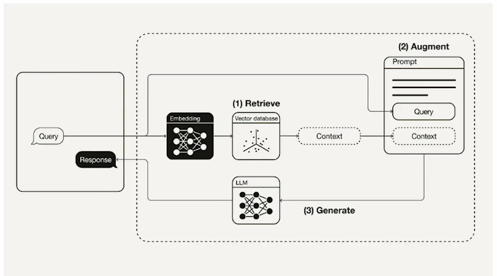
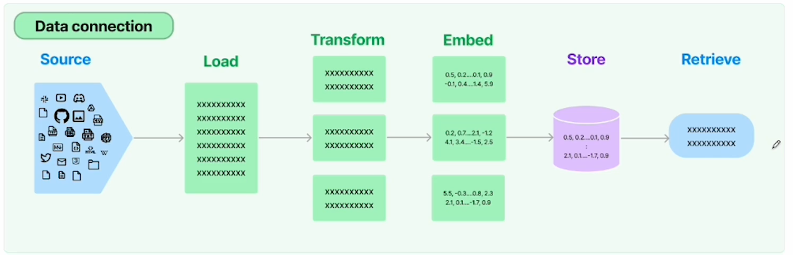
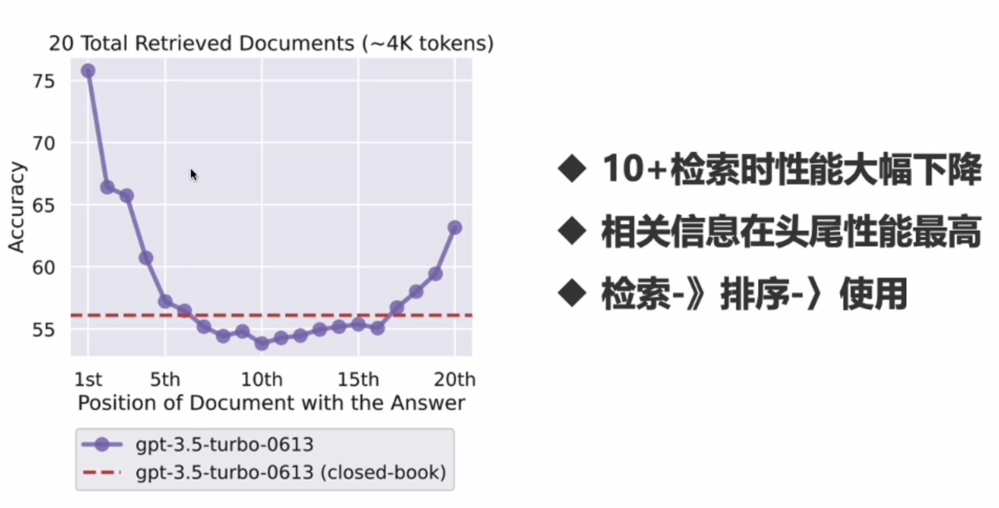

# RAG 

大模型存在知识内容不够新，更新不及时

RAG 技术增强自己大模型能力，实现与各种文档的对话

## 检索增强

2步骤：检索（嵌入） + 生成

为 LLM 提供来自外部知识源的额外信息，它允许生成更准确的上下文，减少幻觉

## RAG 实现

1. 对各种数据源进行封装
2. 提供 loader 加载数据
3. 根据不同数据格式转化（文本切片）
4. 嵌入到向量空间
5. 存储到向量数据库
6. 提供检索工具

## Loader

- CSV loader
- File directory
- Html loader
- json loader
- markdown loader
- pdf loader

## 文档操作

文档切割器，按字符串分割

原理：

1. 将文旦分成小的、有意义的块（句子）
2. 将小的块组合成一个更大的块，直到达到一定的大小
3. 一旦达到一定大小，接着可以创建与下一块重叠的部分

## 文档切割

- 按大小
- 按字符
- 按代码
- 按 token

## 处理长文本切分信息丢失

解决方案：

切分后进行排序，中间放不相干的

## Embed documents

词嵌入向量坐标

到 4.8
