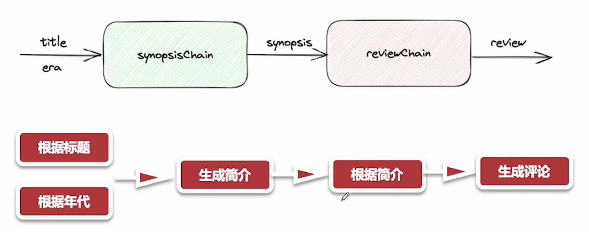
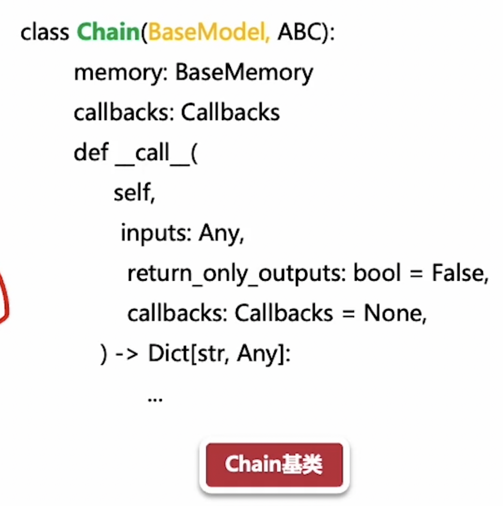
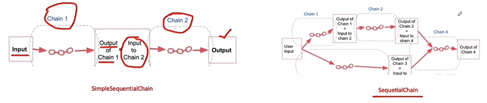
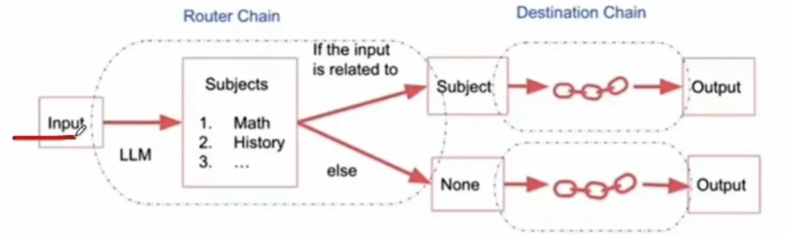
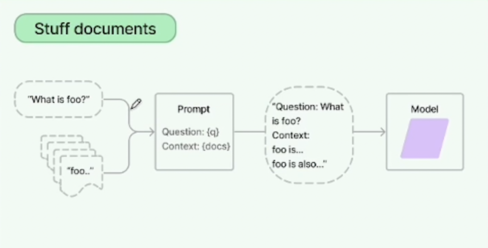
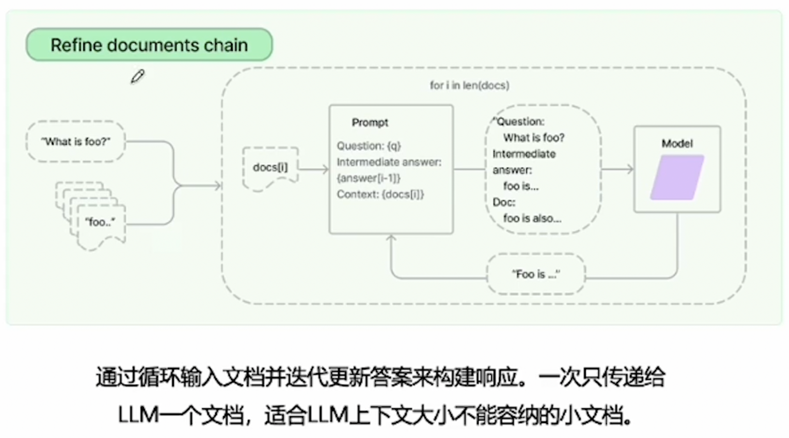
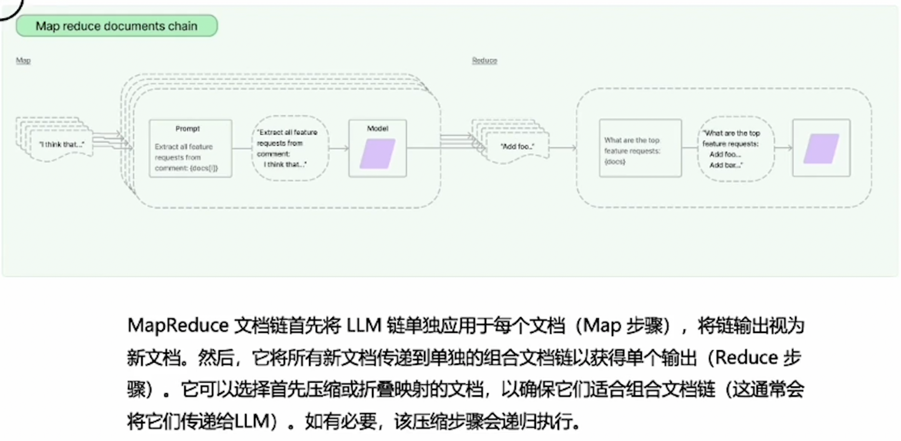
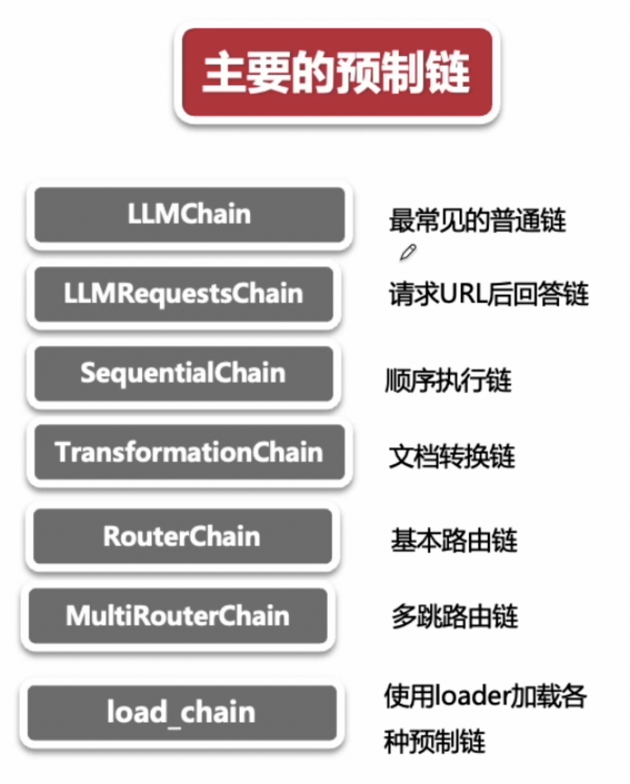

# Langchain 重要组成部件

都是基于 Chain 基类实现

基于 Chain 基类实现的：

- 对话 chain
- QA chain
- 文档 chain

## 4种通用 chain

1. LLMChain

2. SimpleSequentialChain & SequentialChain

自由灵活顺序链

3. RouteChain

Route chain with template 做到自动转发到 底层chain

- Chat chain
- Physics chain
- Math chain

## 自定义 chain

class wiki_article_chain(Chain):

## 处理文档的预制链

针对少量文档情况下：

refine：
不断循环，塞进答案，最后一波提交给 LLM

map reduce document

map rerank

## 整体核心链

