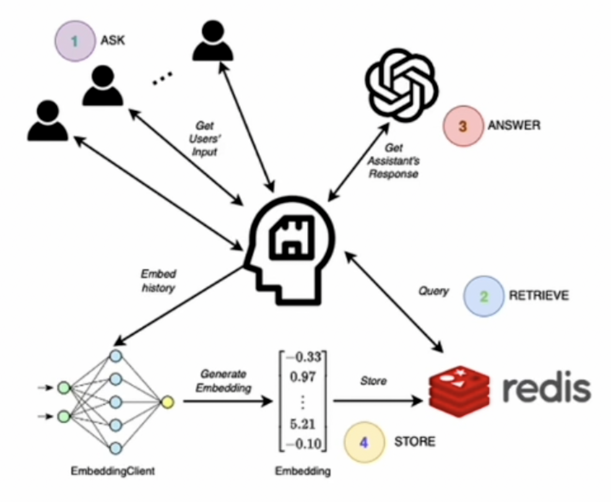

# Memory 解决无状态问题

不同实现 memory 的工具

1. 利用内存实现短期记忆
2. 利用 entity memory 构建实体记忆
3. 利用知识图谱构建记忆
4. 利用对话摘要兼容长对话
5. 使用 token 刷新内存缓冲区
6. 使用向量数据库实现长时记忆

## 长时记忆

- 向量数据库
- redis

## Chains 使用 memory

- LLMChain
- ConversationChain
- 自定义
- 同一个链合并使用多个记忆
- 给一个多参数链增加记忆
