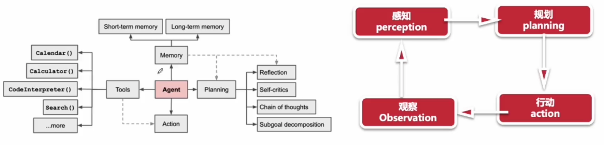
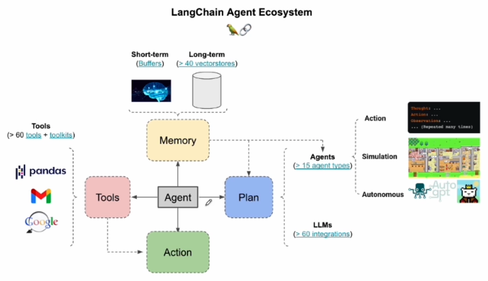
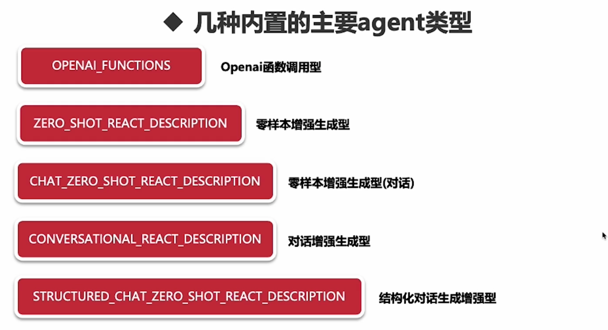

# Agent 核心与实践

Bill Gates：
人工智能代理不仅会改变每个人与计算机交互方式，它们还将颠覆软件行业，带来自我们从键入命令到点击图标以来，最大的计算革命

特点：

1. 无需为不同任务使用单独软件
2. 使用日常语言来命令你的设备
3. “代理”是人工智能的高级形式
4. 未来五年将成为现实
5. 人人都有私人助理 agent
6. 应用于千行百业种
7. 继PC、IOS、安卓后的下一个平台

## Agent 是什么

AI Agents 是基于 LLM，能够自主理解、自主规划决策、执行复杂任务的智能体。Agents 不是 chatGPT 的升级版，它不仅告诉你如何做，更会帮你去做

AI Agents = LLM + 规划技能 + 记忆 + 工具使用

本质上，Agents 是一个 LLM 的编排和执行系统

## Agents 如何实现

1. 提出需求/问题
2. 问题 + prompt 组合
3. ReAct Loop
4. 查找 Memory
5. 查找可用工具
6. 执行工具并观察结果
7. 得到之中结果

可以将 2~6 黑盒化

## Agents 如何实现

内置的集中 agent 类型

- zero shot：零样本学习
- one-short learning：单样本学习
- Few-shot learn：小样本学习

有针对 对话、工具使用等方面进行优化

## 如何给 agent 增加记忆

1. 通过 memory 占位符插入到提示词模板

2. Tool 与 agent 共享记忆

## Tool 和 Tookit 工具集

## Tools 使用

- SerpAPI：聚合搜索引擎
- Dall-E：文到图
- Eleven Labs Text2Speech：文到语音
- GraphQl

## Tookit 使用

- azure ai
- sql toolkit
