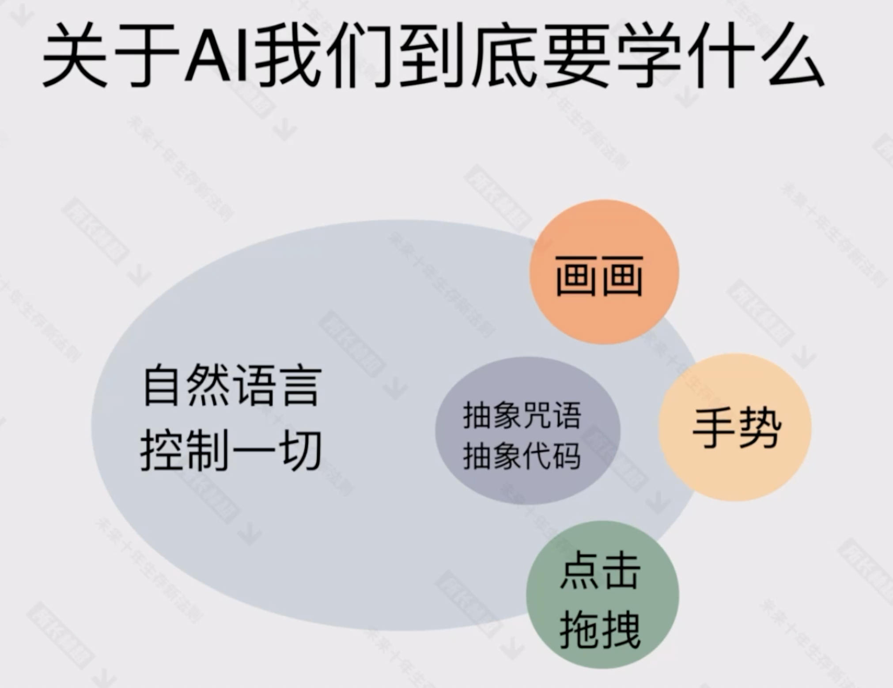
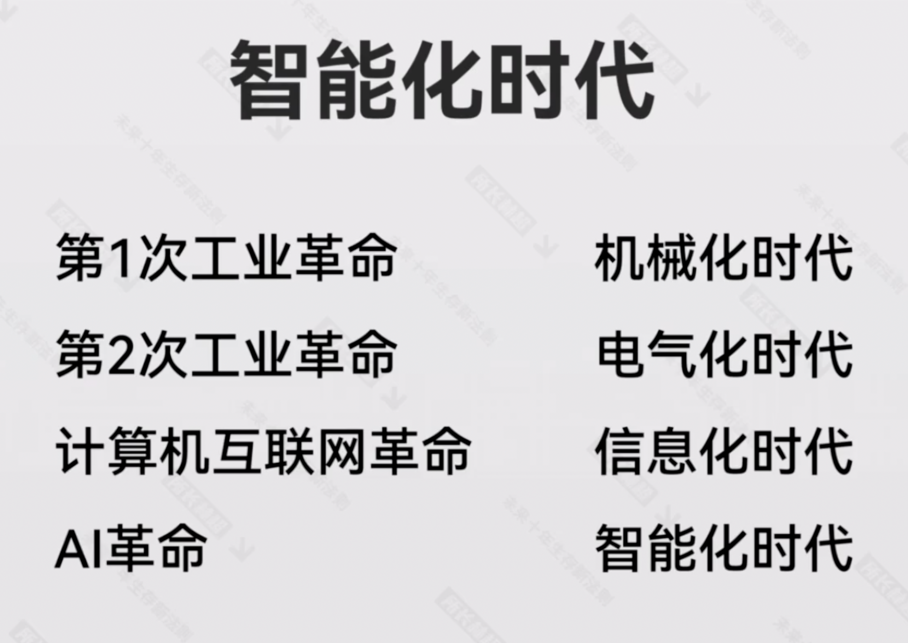
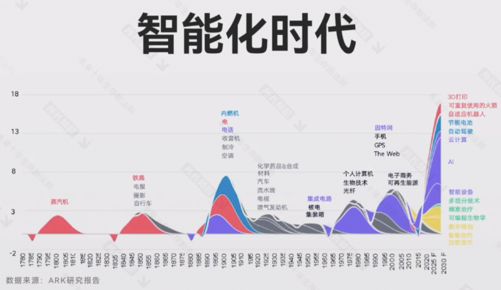
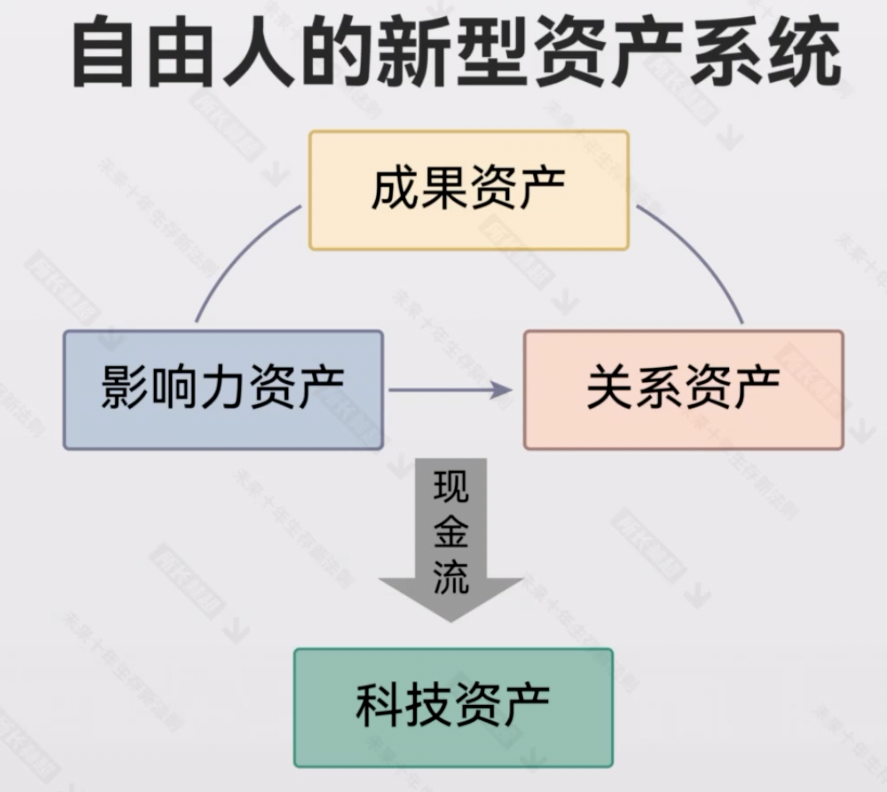
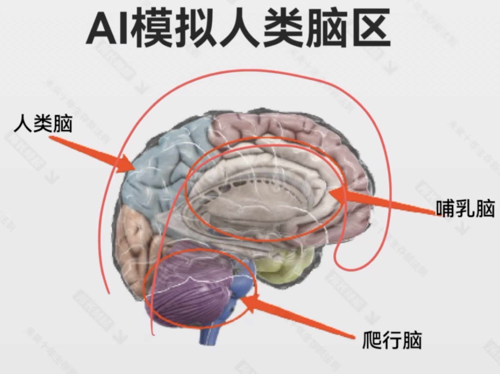
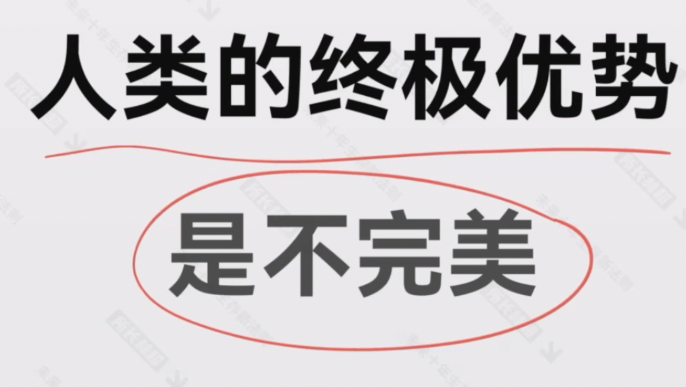
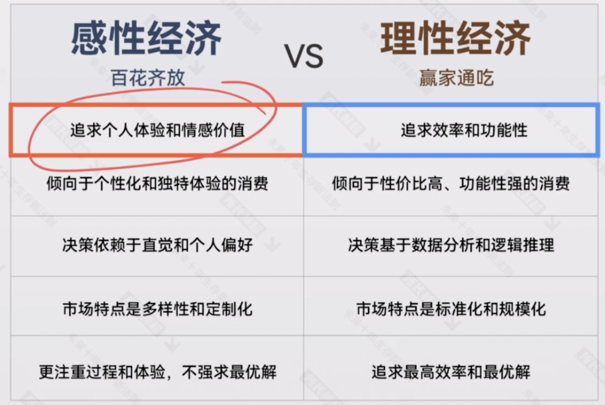

# 第一天

2次工业革命，2次信息革命

2019年之前，高杠杆、高负债，高速增长。2019年之后，低增速阶段，低负债、低杠杆，企业精而专，长期主义

第二次信息革命中，人们的需求、企业的需求都会改变

随着时代发展，信息爆炸，人与人建立信任是越来越难的，稀缺的联系意味着价值

个人 + AI = 全能个人

AI 时代：
- 生产压力变小
- 销售压力变大

全能型老板 + 全能型员工 = 伙伴型关系  （vs 传统的控制型全系）

大脑建模：

AI 只模拟了新皮脂层，高级脑的部分，人工智能对于规划、想象力等其他地方（理性脑），非常强

但情感中枢没有建模，以及用来承载各种各样的神经递质建模
- 感情
- 信任
- 责任

微生物的菌群在人类中差异非常小，但非常重要，会影响情绪。
所以这些差距，也是人与人之间的差异

人把自己不完美的特点，经过一些痛苦、磨砺，然后变得完美的人，把这个过程打包成产品

中国的机会：与 AI 生态成为互补位

体验经济：抓住感兴经济崛起的机遇

女性创业的很好时代

国学复兴、文学复兴

互联网：生产关系的构建
人工智能：生产力

中国机遇之一：
新建关系：
AI时代的新型社群

中国机遇之二：
- 微信
- 小红书

亲密关系方向

中国机遇之三：

中小企业的服务市场

