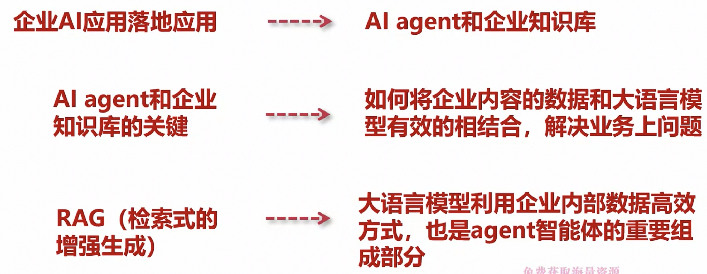
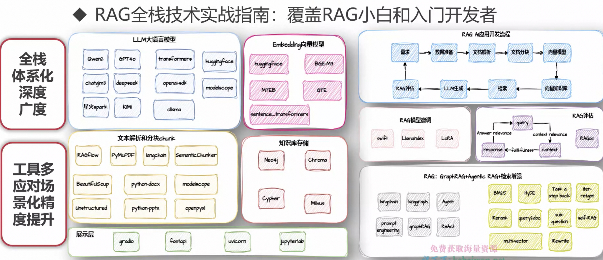
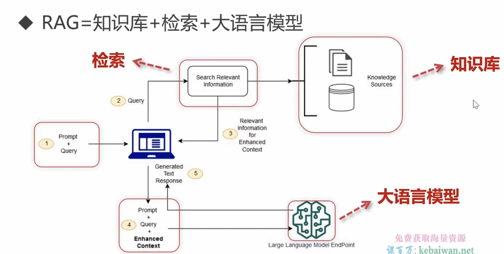

# 前置

## 介绍

1. 大语言模式适用场景

...

2. 大语言模型局限

- 缺乏企业专业知识（存在幻觉）

- 知识时效性

- 结果不可解释型（输出具有随机性）

3. RAG 核心

4. LLM 长上下文 vs RAG

LLM 虽然有长上下文，但是从“大海捞针”测试中，实际测试效果，还是不能找到所有有效信息

所以企业级应用还是需要 RAG

## RAG 面临问题

1. 企业数据复杂多样

2. 处理好的数据，如何建立知识库

3. 用户问题的多样

4. 如何高效检索

5. 如何对多个上下文排序

6. 如何评估 RAG 系统
