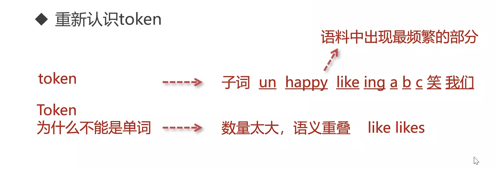
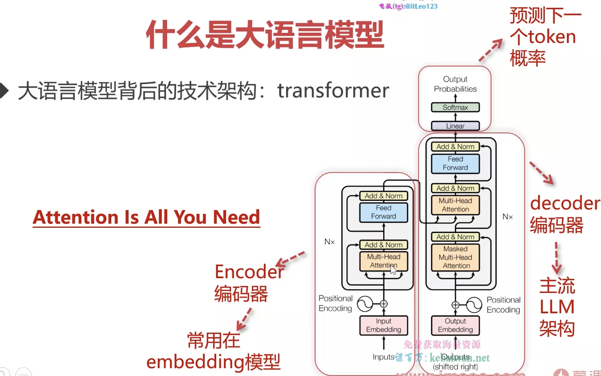
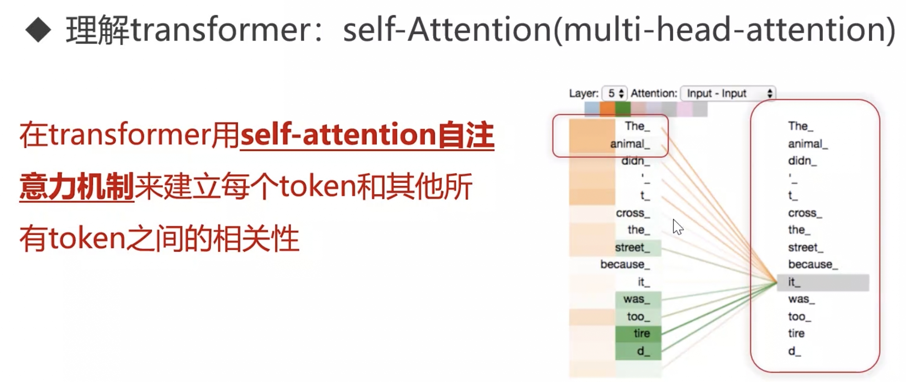
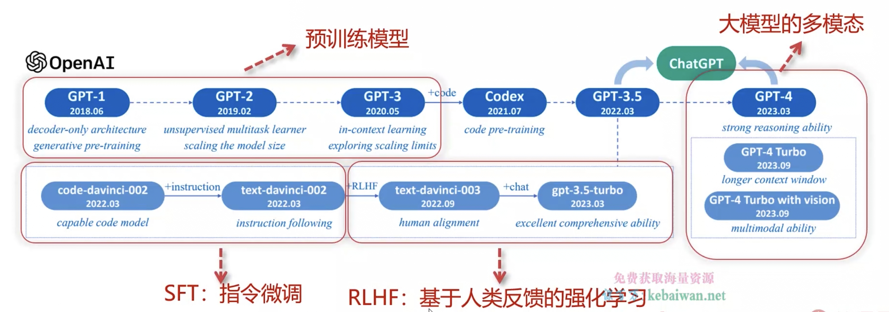
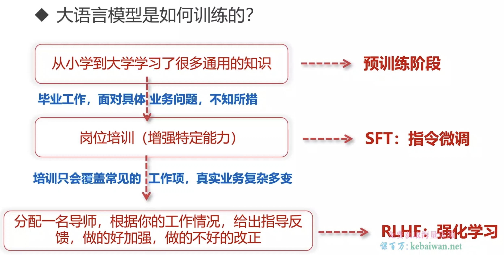
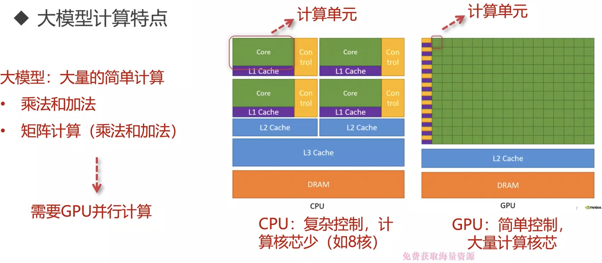

# 大模型介绍

## Token 介绍

后续文字推测

衡量预测的文字：token

BPE tokenizer（从小到大合并）流程：

1. 给定语料
2. 根据出现频率组合（子词）

单个单词不能作为 token，单个字符也不行

## Transformer 架构

1. 编码器
2. 解码器（预测）

自注意机制

预训练模型

SFT：指令微调

RLHF：基于人类反馈强化学习

## CPU vs GPU

本地部署大模型，通过 localhost 调用
