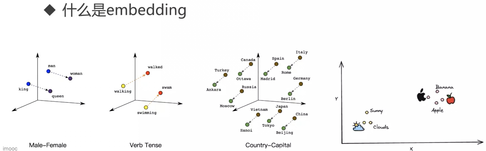
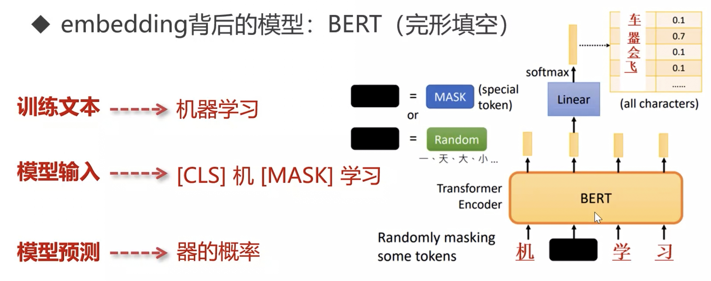
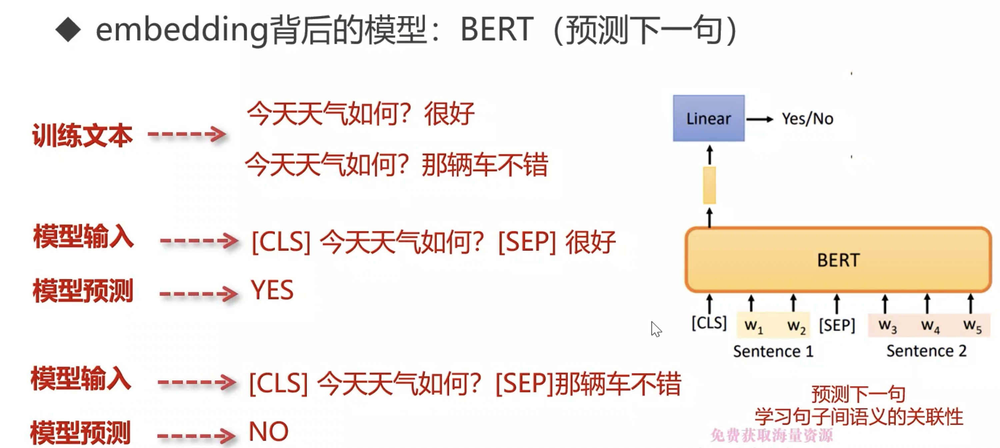
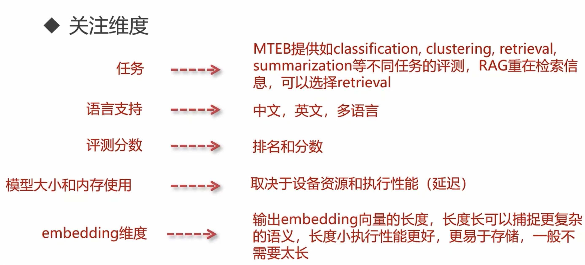
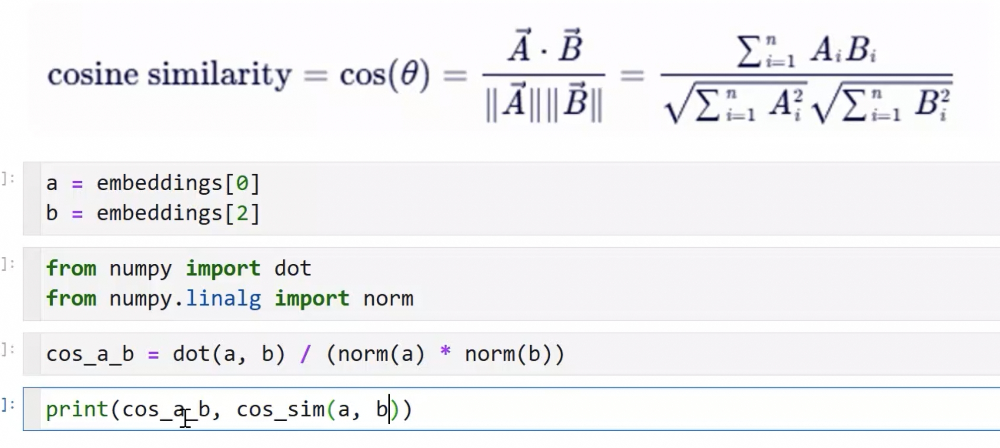

# RAG embedding



## embedding 架构

BERT：Transformer 中的 encoder 部分

1. 完形填空



2. 预测下一句



## MTEB 榜单

embedding 评测

1. BERT 架构：阿里的 GTE 系列

- 通过配对模型来训练，embedding 距离尽可能相近

1. BERT 架构：BAAI 的 BGE 系列

## embedding 模型关注



## embedding 基本操作

embedding 模型也实现了 Transformer 架构，具体来说是 Transformer 架构的编码器

所以能够使用 Transformer 直接调用

1. from transformer

```py
from transformers import AutoTokenizer, AutoModel

input_texts = [
  "xxx",
  "xxx"
]

model_path = './local/xxx'
tokenizer = AutoTokenizer.from_pretrained(model_path)
model = AutoModel.from_pretrained(model_path, device_map='cpu')

batch_token = tokenizer(
  input_texts,
  max_length = 30,
  padding = True,
  truncation = True,
  return_tensors = 'pt'
)

batch_token[0].tokens
```

2. from sentence_transformers

```py
from sentence_transformers import SentenceTransformer

model_path = './local/xxx'
model = SentenceTransformer(model_path)
embeddings = model.encode(input_texts)
```

3. langchain 通过 huggingface 调用

```py
from langchain.embeddings.huggingface import HuggingFaceEmbeddings
import numpy as np

model_path = './local/xxx'
model = HuggingFaceEmbeddings(model_path, model_kwargs = {"device": "cpu"})
embeddings = model.embed_documents(input_texts)
```


