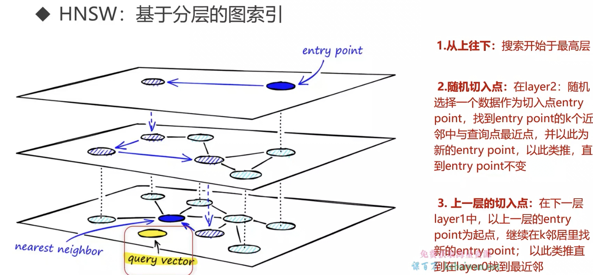

# 向量数据库

有向量数据库，也有传统数据库

有些传统数据库也支持将 向量 存入进去，如 ES，redis

## 向量数据库

1. chroma

2. milvus

## 相似度度量

1. 距离度量

欧式距离

2. 余弦相似度

判断夹角，只关注夹角，不看长度

优势是处理文本数据，有效比较单词相似

## 数据检索优化

1. index 索引

2. IVF：基于划分的算法

划分成 k 个块，差不多 1000个

找到最接近的块，然后在块中进行扫描

3. HNSW 基于图层的算法

4. 乘积向量
