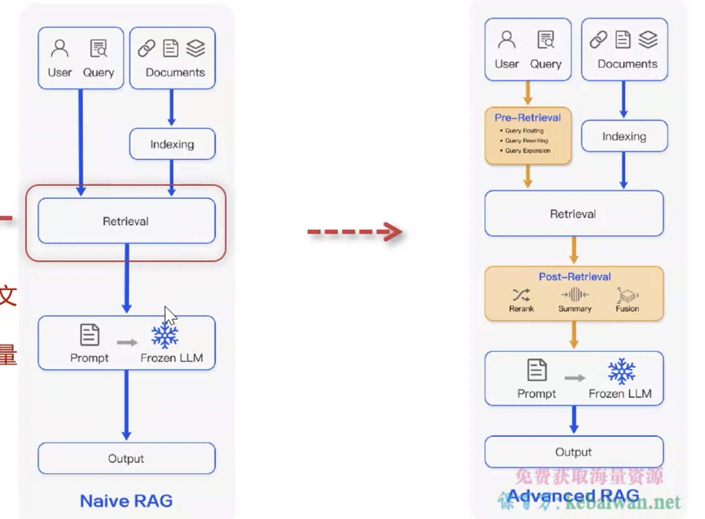
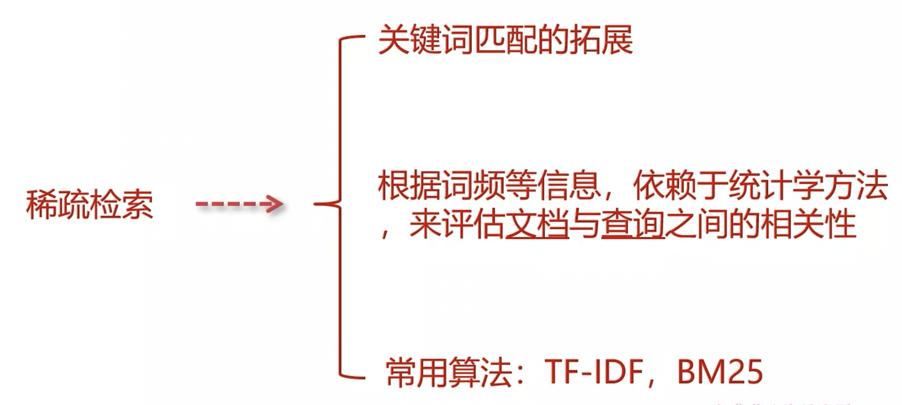
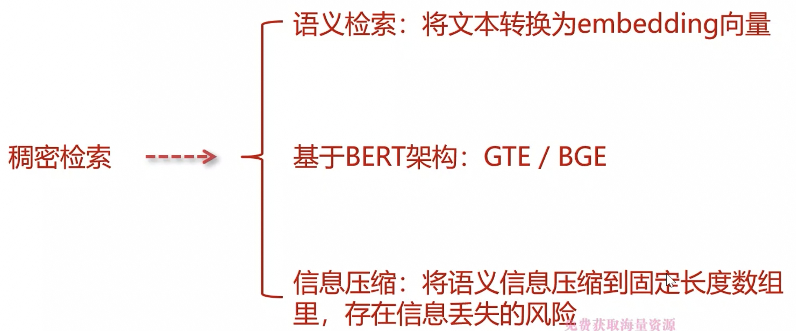
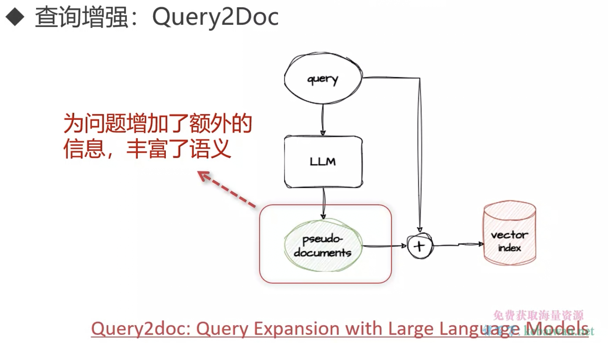
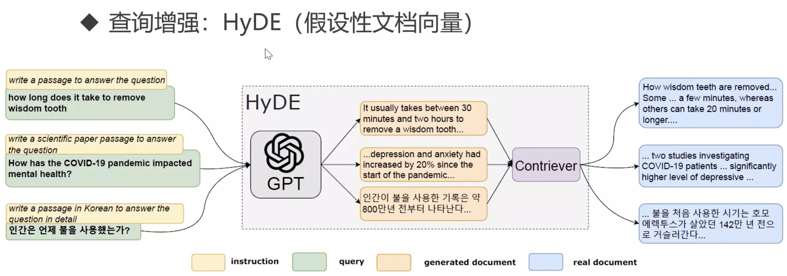
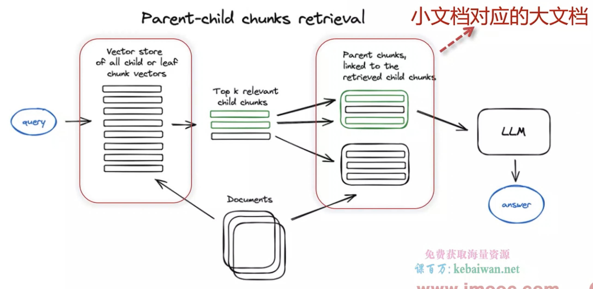
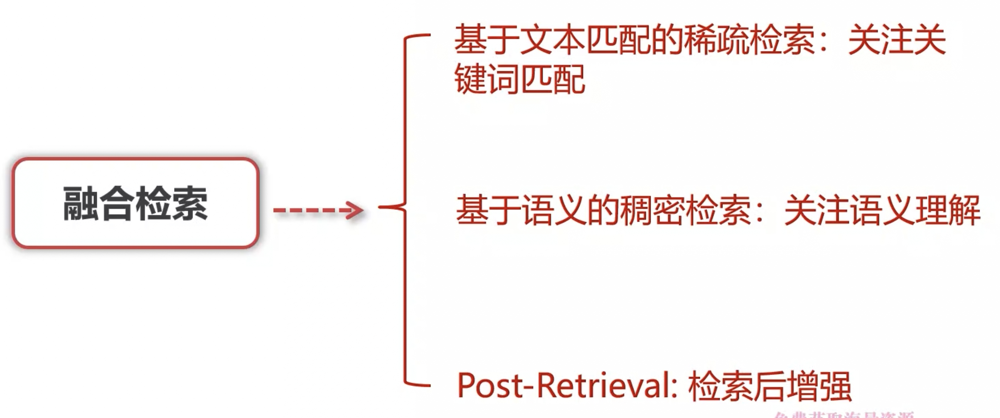
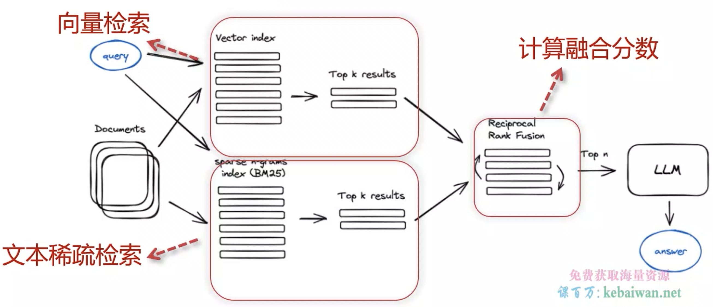

# RAG增强

## 增强方法

1. pre-retrieval, post-retrieval

2. modular

## 稀疏检索

1. TF-IDF 算法：

- 词频（TF）
- 逆文档频率（IDF）

log(KB总数 / 包含改词的文档数+1)

- TF-IDF：TF * IDF

2. BM25 算法：
TF-IDF 的变种

3. 稀疏检索缺点：

考虑词频，不关注顺序和上下文：

如：男朋友送的礼物；送男朋友的礼物

## 稠密检索

## 不同的检索增加技术

### 1. 查询增强

通过对用户查询进行改造，使其更加清晰、明确，与文档语义一致

**query2Doc**

让LLM先尝试回答，并携带更多的关键字上下文

**HyDE**

回答之后，先向量化，平均化后再检索。比较适合稠密化检索

Langchain 有封装

### 2. 子问题查询

利用 LLM 将问题拆解问题更细节的问题

### 3. 查询改写

以多角度进行重写问题

### 4. 多索引检索

**父子文档（small2big）**

检索是小文档，返回是大文档

**总结索引**

文档块做总结，生成摘要，对总结向量化，再去检索

**文档假设问题**

### 5. 混合检索

各自检索到 top k 的文档，然后通过加权分数，进行汇总排序

### 6. Rerank 重排序

### 7. 迭代检索增强生成

